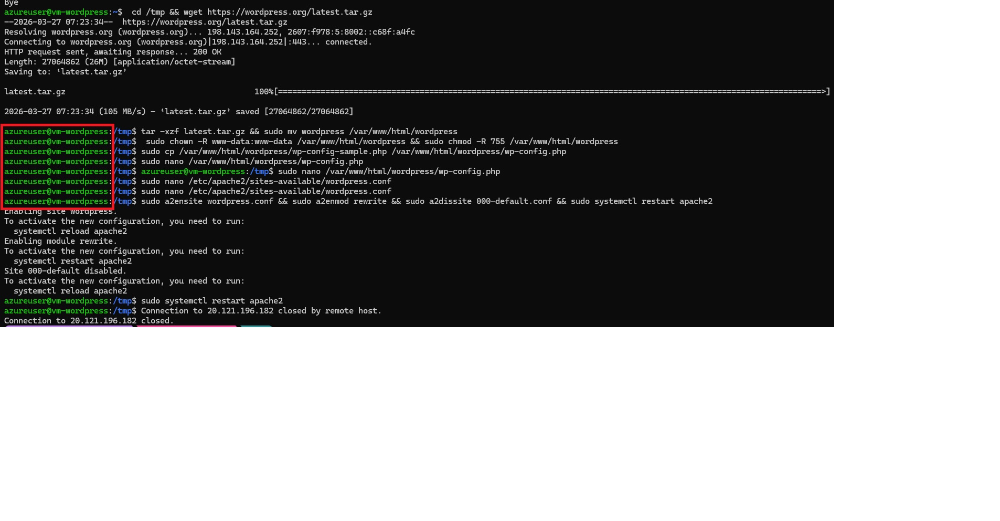
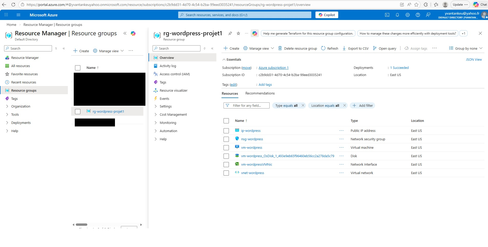
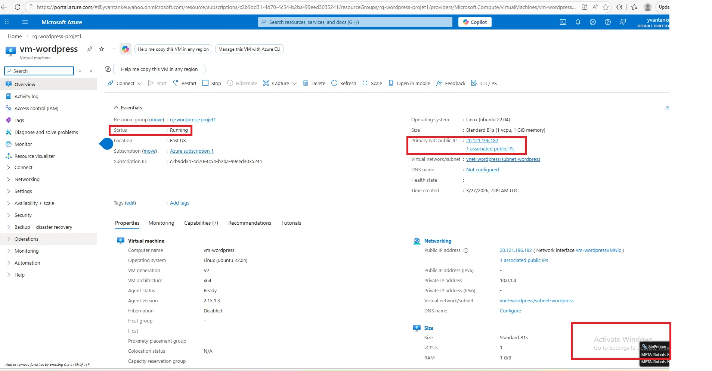
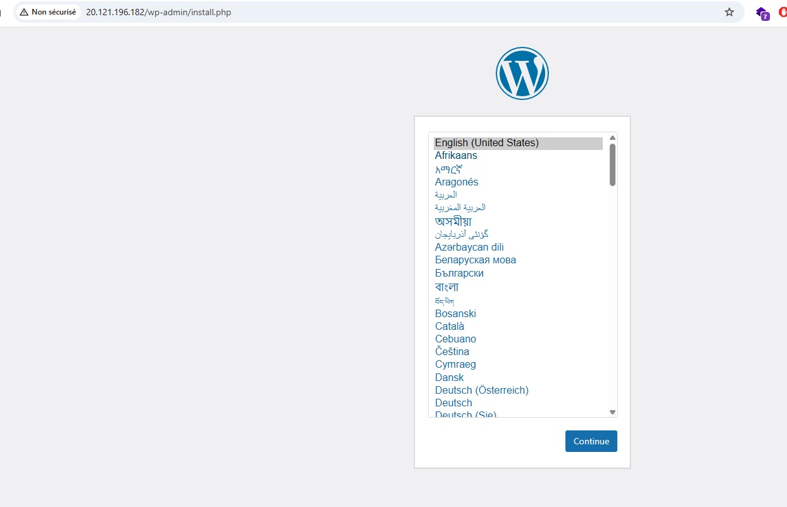
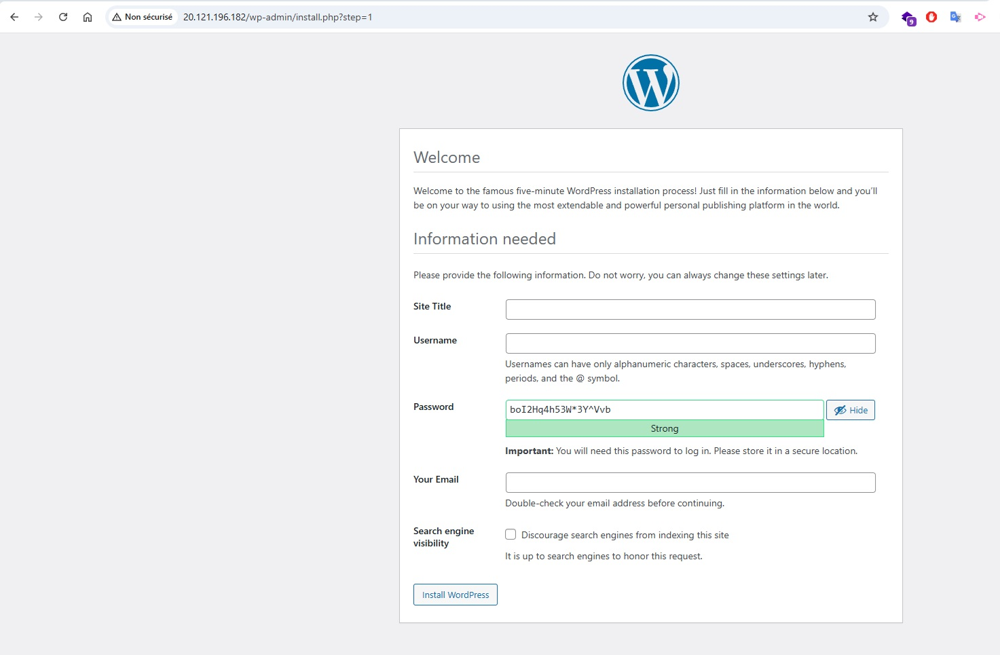

# Projet 1 — Héberger WordPress sur Azure VM

## Objectif
Déployer un serveur WordPress complet sur une VM Ubuntu dans Azure, en configurant le réseau, la sécurité et le serveur web manuellement via Azure CLI.

## Architecture

```
Internet
    │
    │ Port 80/443
    ▼
[IP Publique : 20.121.196.182]
    │
    ▼
[NSG nsg-wordpress]
    ├── Allow SSH   → port 22
    ├── Allow HTTP  → port 80
    └── Allow HTTPS → port 443
    │
    ▼
[VM Ubuntu 22.04 — Standard_B1s]
[IP Privée : 10.0.1.4]
    │
    └── dans [Subnet 10.0.1.0/24]
            └── dans [VNet 10.0.0.0/16]
                    └── dans [Resource Group rg-wordpress-projet1]
                                    └── Region : eastus
```

## Ressources créées

| Ressource | Nom | Détails |
|-----------|-----|---------|
| Resource Group | rg-wordpress-projet1 | eastus |
| Virtual Network | vnet-wordpress | 10.0.0.0/16 |
| Subnet | subnet-wordpress | 10.0.1.0/24 |
| NSG | nsg-wordpress | Ports 22, 80, 443 |
| IP Publique | ip-wordpress | 20.121.196.182 (Static) |
| VM | vm-wordpress | Ubuntu 22.04, Standard_B1s |

## Stack installée sur la VM

- Apache2
- PHP + extensions (mysql, curl, gd, mbstring, xml)
- MySQL 8.0
- WordPress (dernière version)

## Preuves visuelles

### 1. Connexion SSH à la VM Ubuntu

> Connexion réussie à la VM Ubuntu 22.04 hébergée dans Azure via SSH.

---

### 2. Resource Group avec toutes les ressources

> Le Resource Group `rg-wordpress-projet1` contient toutes les ressources du projet : VM, VNet, NSG, IP publique, disque.

---

### 3. VM Ubuntu en cours d'exécution

> La VM `vm-wordpress` de taille Standard_B1s tourne sous Ubuntu Server 22.04 dans Azure.

---

### 4. Page d'installation WordPress — Choix de langue

> WordPress accessible via l'IP publique `http://20.121.196.182` — page de sélection de la langue d'installation.

---

### 5. WordPress — Configuration du site

> Deuxième étape de l'installation WordPress : configuration du nom du site, identifiants admin et email.

---

## Compétences démontrées

- Azure CLI
- Virtual Networks & Subnets
- Network Security Groups (NSG)
- IP Publique statique
- VM Linux sur Azure
- Administration Linux (SSH, apt, permissions)
- Installation LAMP stack
- Configuration Apache VirtualHost
- Déploiement WordPress

## Commandes clés

```bash
# Créer le Resource Group
az group create --name rg-wordpress-projet1 --location eastus

# Créer le VNet + Subnet
az network vnet create --resource-group rg-wordpress-projet1 --name vnet-wordpress --address-prefix 10.0.0.0/16 --subnet-name subnet-wordpress --subnet-prefix 10.0.1.0/24

# Créer le NSG
az network nsg create --resource-group rg-wordpress-projet1 --name nsg-wordpress

# Ajouter les règles NSG
az network nsg rule create --resource-group rg-wordpress-projet1 --nsg-name nsg-wordpress --name Allow-SSH --protocol Tcp --direction Inbound --priority 1000 --source-address-prefix "*" --destination-port-range 22 --access Allow
az network nsg rule create --resource-group rg-wordpress-projet1 --nsg-name nsg-wordpress --name Allow-HTTP --protocol Tcp --direction Inbound --priority 1010 --source-address-prefix "*" --destination-port-range 80 --access Allow
az network nsg rule create --resource-group rg-wordpress-projet1 --nsg-name nsg-wordpress --name Allow-HTTPS --protocol Tcp --direction Inbound --priority 1020 --source-address-prefix "*" --destination-port-range 443 --access Allow

# Créer l'IP publique
az network public-ip create --resource-group rg-wordpress-projet1 --name ip-wordpress --sku Standard --allocation-method Static

# Créer la VM
az vm create --resource-group rg-wordpress-projet1 --name vm-wordpress --image Ubuntu2204 --size Standard_B1s --admin-username azureuser --generate-ssh-keys --vnet-name vnet-wordpress --subnet subnet-wordpress --nsg nsg-wordpress --public-ip-address ip-wordpress

# Se connecter à la VM
ssh azureuser@20.121.196.182

# Éteindre la VM (économiser les coûts)
az vm deallocate --resource-group rg-wordpress-projet1 --name vm-wordpress

# Supprimer toutes les ressources
az group delete --name rg-wordpress-projet1 --yes
```

## Description pour CV

> Déployé un serveur WordPress sur Azure VM (Ubuntu 22.04) en configurant une architecture réseau complète : Virtual Network, Subnet, NSG avec règles de sécurité, IP publique statique. Installation et configuration manuelle d'une stack LAMP (Apache, MySQL, PHP) via SSH. Utilisation d'Azure CLI pour l'automatisation du déploiement.

**Compétences :** Azure CLI · VM · VNet · NSG · Linux · Apache · MySQL · WordPress
