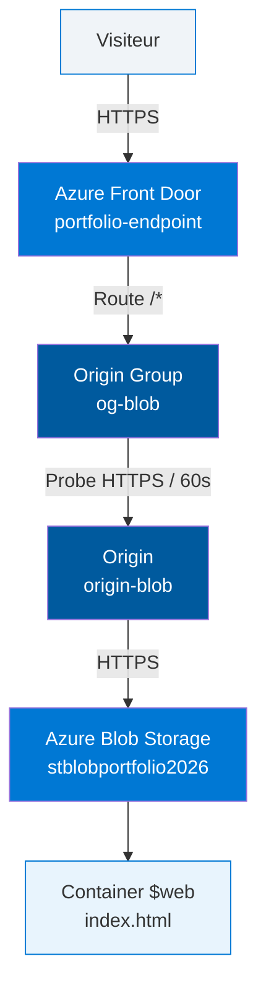
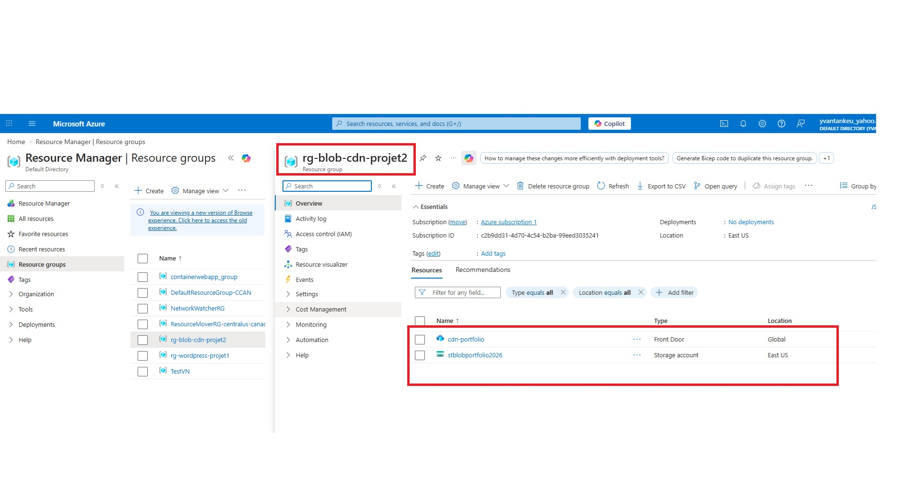
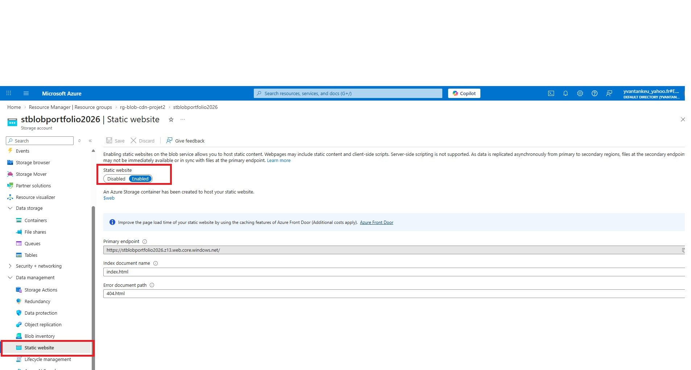
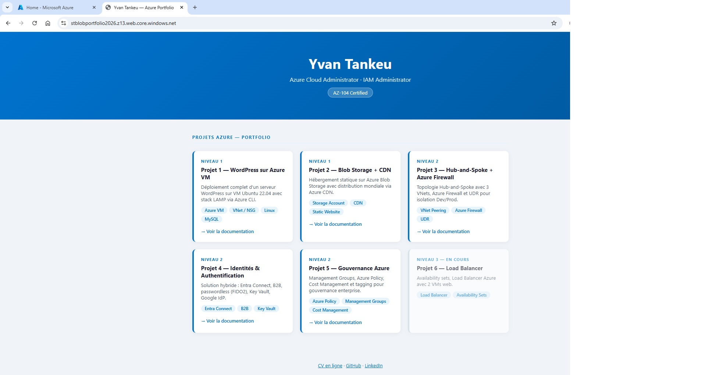
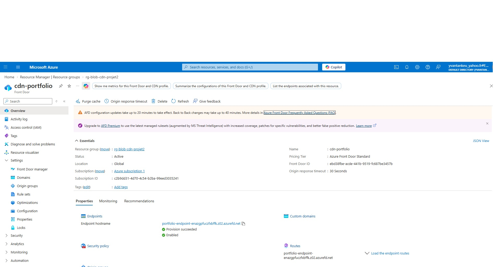
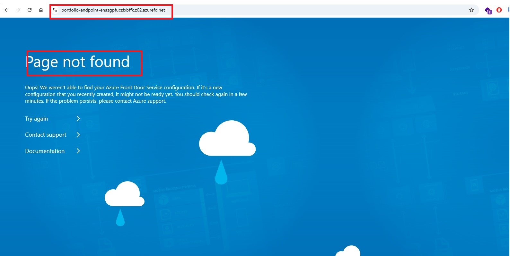
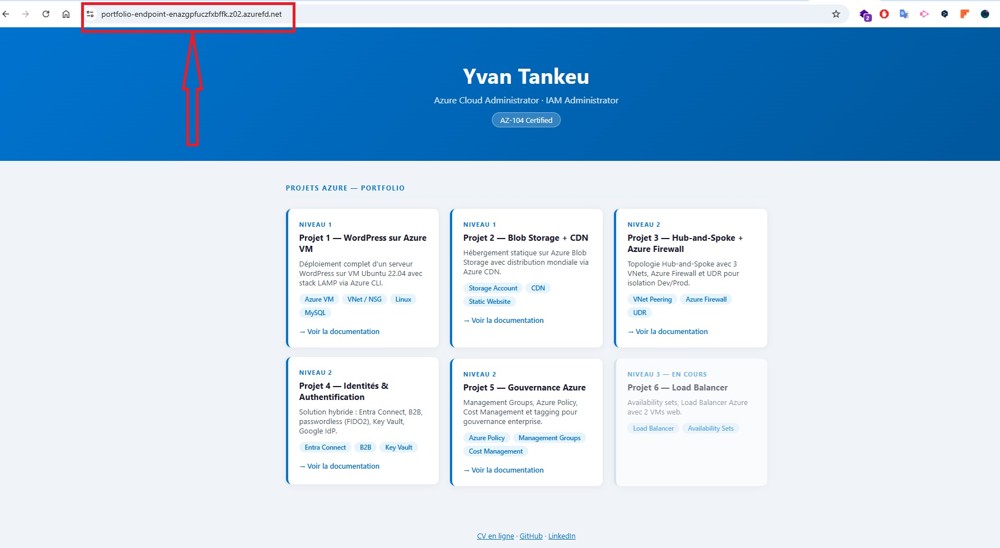

# Projet 2 — Azure Blob Storage + CDN Statique

## Objectif
Héberger un site web statique sur Azure Blob Storage et le distribuer mondialement via Azure Front Door (CDN), en configurant l'ensemble de la chaîne de livraison de contenu via Azure CLI.

## Architecture



## Ressources créées

| Ressource | Nom | Détails | Utilité |
|-----------|-----|---------|---------|
| Resource Group | rg-blob-cdn-projet2 | eastus | Conteneur logique pour toutes les ressources du projet |
| Storage Account | stblobportfolio2026 | Standard_LRS, StorageV2 | Stocke les fichiers du site statique |
| Static Website | activé | index.html / 404.html | Expose le contenu du Blob via une URL web publique |
| CDN Profile | cdn-portfolio | Standard_AzureFrontDoor | Conteneur du service CDN — gère les paramètres globaux |
| CDN Endpoint | portfolio-endpoint | `portfolio-endpoint-enazgpfuczfxbffk.z02.azurefd.net` | URL publique du CDN exposée aux visiteurs |
| Origin Group | og-blob | probe HTTPS toutes les 60s | Groupe de sources avec surveillance de santé et équilibrage |
| Origin | origin-blob | `stblobportfolio2026.z13.web.core.windows.net` | Pointe le CDN vers le Blob Storage comme source de contenu |
| Route | route-blob | `/*` → HTTPS only | Définit comment les requêtes sont acheminées vers l'origine |
| Role Assignment | Storage Blob Data Contributor | auth-mode login | Permet l'upload de fichiers sans clé de compte |

## URLs

- **Blob Storage direct** : `https://stblobportfolio2026.z13.web.core.windows.net`
- **Azure Front Door (CDN)** : `https://portfolio-endpoint-enazgpfuczfxbffk.z02.azurefd.net`

## Preuves visuelles

### 1. Resource Group avec toutes les ressources


---

### 2. Storage Account — Static Website activé


---

### 3. Site accessible via l'URL Blob Storage


---

### 4. Azure Front Door — Profil CDN


---

### 5. Azure Front Door — Propagation en cours

> Erreur "Page not found" d'Azure Front Door pendant la propagation de la configuration aux PoPs mondiaux (~20-30 min).

---

### 6. Site accessible via l'URL CDN (après propagation)

> Site portfolio accessible via Azure Front Door : `https://portfolio-endpoint-enazgpfuczfxbffk.z02.azurefd.net`

---

## Compétences démontrées

- Azure Blob Storage & Static Website
- Azure Front Door Standard (CDN)
- Origin Group, Origin, Route
- RBAC — Role Assignment via Azure CLI
- Azure CLI — déploiement complet sans portail

## Commandes clés

```bash
# Créer le Resource Group
az group create \
  --name rg-blob-cdn-projet2 \
  --location eastus

# Créer le Storage Account
az storage account create \
  --name stblobportfolio2026 \
  --resource-group rg-blob-cdn-projet2 \
  --location eastus \
  --sku Standard_LRS \
  --kind StorageV2

# Activer le Static Website
az storage blob service-properties update \
  --account-name stblobportfolio2026 \
  --static-website \
  --index-document index.html \
  --404-document 404.html

# Assigner le rôle Storage Blob Data Contributor
az role assignment create \
  --role "Storage Blob Data Contributor" \
  --assignee $(az ad signed-in-user show --query id -o tsv) \
  --scope "/subscriptions/c2b9dd31-4d70-4c54-b2ba-99eed3035241/resourceGroups/rg-blob-cdn-projet2/providers/Microsoft.Storage/storageAccounts/stblobportfolio2026"

# Uploader le site dans le container $web
az storage blob upload \
  --account-name stblobportfolio2026 \
  --container-name '$web' \
  --name index.html \
  --file projet-2-blob-cdn\index.html \
  --content-type "text/html" \
  --auth-mode login

# Créer le profil Azure Front Door
az cdn profile create \
  --name cdn-portfolio \
  --resource-group rg-blob-cdn-projet2 \
  --sku Standard_AzureFrontDoor

# Créer l'endpoint
az afd endpoint create \
  --endpoint-name portfolio-endpoint \
  --profile-name cdn-portfolio \
  --resource-group rg-blob-cdn-projet2 \
  --enabled-state Enabled

# Créer l'origin group
az afd origin-group create \
  --origin-group-name og-blob \
  --profile-name cdn-portfolio \
  --resource-group rg-blob-cdn-projet2 \
  --probe-request-type GET \
  --probe-protocol Https \
  --probe-interval-in-seconds 60 \
  --sample-size 4 \
  --successful-samples-required 3

# Créer l'origin
az afd origin create \
  --origin-name origin-blob \
  --profile-name cdn-portfolio \
  --resource-group rg-blob-cdn-projet2 \
  --origin-group-name og-blob \
  --host-name stblobportfolio2026.z13.web.core.windows.net \
  --origin-host-header stblobportfolio2026.z13.web.core.windows.net \
  --priority 1 \
  --weight 1000 \
  --https-port 443 \
  --http-port 80 \
  --enabled-state Enabled

# Créer la route
az afd route create \
  --route-name route-blob \
  --profile-name cdn-portfolio \
  --resource-group rg-blob-cdn-projet2 \
  --endpoint-name portfolio-endpoint \
  --origin-group og-blob \
  --supported-protocols Https \
  --patterns-to-match "/*" \
  --forwarding-protocol HttpsOnly \
  --https-redirect Enabled \
  --link-to-default-domain Enabled

# Éteindre / Supprimer les ressources
az group delete --name rg-blob-cdn-projet2 --yes
```

## Description pour CV

> Déployé un site statique sur Azure Blob Storage avec distribution mondiale via Azure Front Door (CDN). Configuration complète via Azure CLI : Storage Account, activation du Static Website, création du profil CDN Standard, origin group, origin et route HTTPS. Mise en place du contrôle d'accès RBAC (Storage Blob Data Contributor) pour l'authentification sans clé.

**Compétences :** Azure Blob Storage · Azure Front Door · CDN · Static Website · RBAC · Azure CLI
