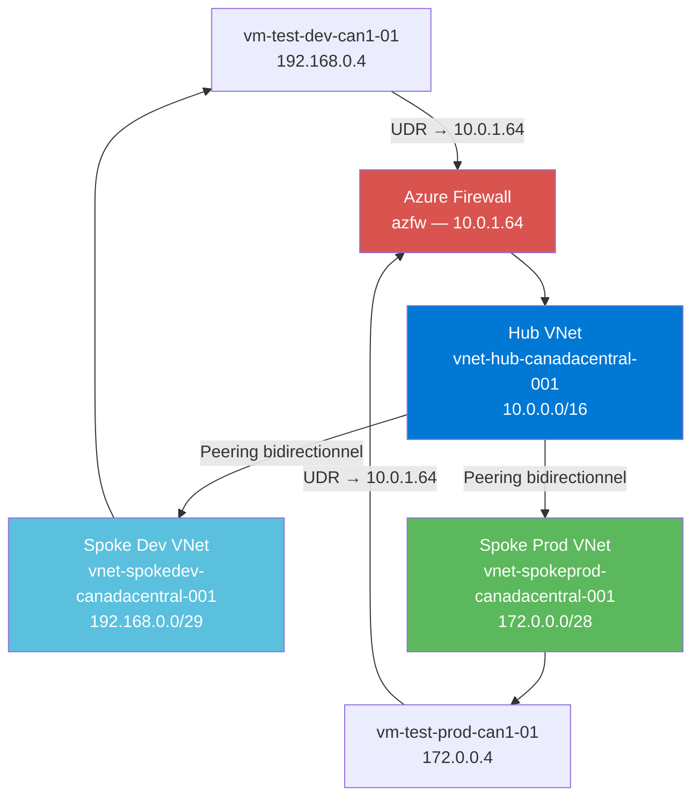
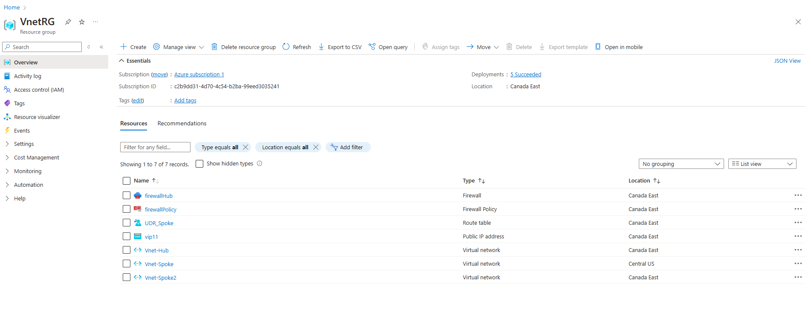
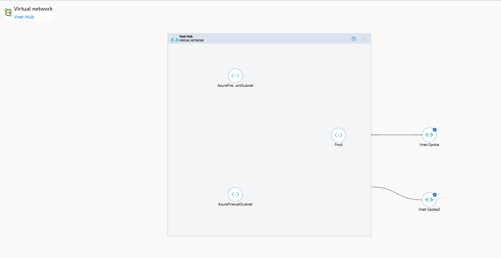
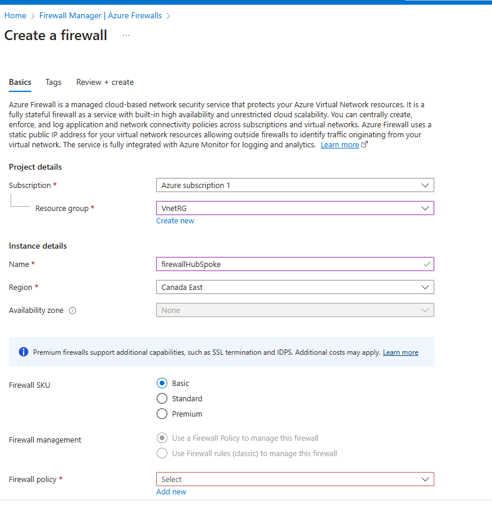
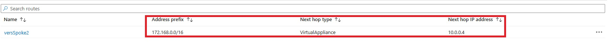
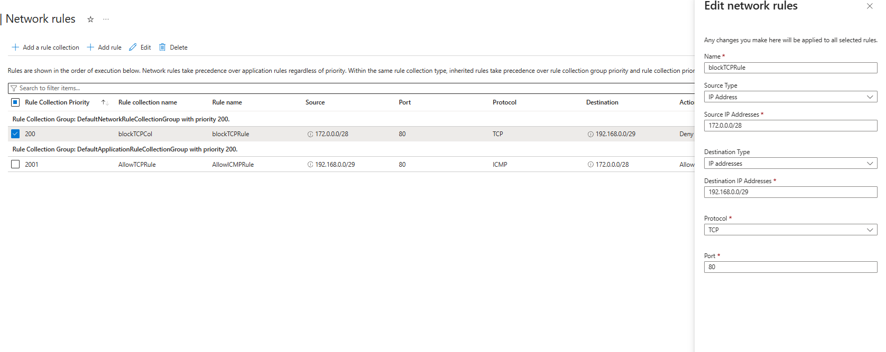
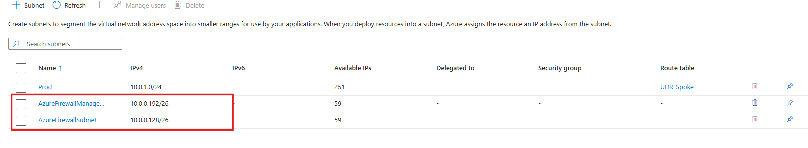

# Projet 3 — Architecture Hub-and-Spoke avec Azure Firewall

## Objectif
Déployer une topologie réseau Hub-and-Spoke dans Azure pour isoler les environnements Dev et Prod, en forçant tout le trafic inter-spoke à transiter par un Azure Firewall central configuré avec des règles réseau explicites.

## Architecture



## Ressources créées

| Ressource | Nom | Détails | Utilité |
|-----------|-----|---------|---------|
| Resource Group | rg-hub-spoke-projet3 | canadacentral | Conteneur logique pour toutes les ressources du projet |
| VNet Hub | vnet-hub-canadacentral-001 | 10.0.0.0/16 | Réseau central qui connecte tous les spokes |
| VNet Dev | vnet-spokedev-canadacentral-001 | 192.168.0.0/29 | Réseau isolé pour l'environnement de développement |
| VNet Prod | vnet-spokeprod-canadacentral-001 | 172.0.0.0/28 | Réseau isolé pour l'environnement de production |
| VNet Peering | hub↔dev, hub↔prod | Bidirectionnel | Connecte les spokes au hub sans peering direct entre eux |
| Azure Firewall | azfw | IP privée : 10.0.1.64 | Filtre et contrôle tout le trafic inter-spoke |
| Route Table Dev | rt-vnetdev-to-vnetprod | Next hop : 10.0.1.64 | Force le trafic Dev→Prod via le firewall |
| Route Table Prod | rt-vnetprod-to-vnetdev | Next hop : 10.0.1.64 | Force le trafic Prod→Dev via le firewall |
| VM Dev | vm-test-dev-can1-01 | IP : 192.168.0.4 | Machine de test dans le Spoke Dev |
| VM Prod | vm-test-prod-can1-01 | IP : 172.0.0.4 | Machine de test dans le Spoke Prod |
| Règle Firewall | Allow-Dev-Prod | ICMP + TCP bidirectionnel | Autorise la communication entre les deux VMs |

## Preuves visuelles

### 1. Resource Group avec toutes les ressources


---

### 2. Les 3 VNets et leur peering


---

### 3. Azure Firewall — Configuration et IP


---

### 4. Route Table — UDR avec next hop Virtual Appliance

> Route `versSpoke2` : destination `172.168.0.0/16`, next hop `VirtualAppliance` → `10.0.0.4` (Azure Firewall).

---

### 5. Règle Firewall autorisant la communication Dev↔Prod


---

### 6. Subnets avec UDR appliquée

> UDR `UDR_Spoke` associée au subnet `Prod` — tout le trafic inter-spoke transite par le firewall.

---

## Compétences démontrées

- Hub-and-Spoke network topology
- VNet Peering bidirectionnel
- Azure Firewall comme NVA (Network Virtual Appliance)
- User Defined Routes (UDR)
- Règles réseau Azure Firewall
- Isolation des environnements Dev/Prod

## Commandes clés

```bash
# Créer le Resource Group
az group create \
  --name rg-hub-spoke-projet3 \
  --location canadacentral

# Créer le VNet Hub
az network vnet create \
  --name vnet-hub-canadacentral-001 \
  --resource-group rg-hub-spoke-projet3 \
  --address-prefix 10.0.0.0/16 \
  --subnet-name AzureFirewallSubnet \
  --subnet-prefix 10.0.1.0/26

# Créer le VNet Spoke Dev
az network vnet create \
  --name vnet-spokedev-canadacentral-001 \
  --resource-group rg-hub-spoke-projet3 \
  --address-prefix 192.168.0.0/29 \
  --subnet-name subnet-dev \
  --subnet-prefix 192.168.0.0/29

# Créer le VNet Spoke Prod
az network vnet create \
  --name vnet-spokeprod-canadacentral-001 \
  --resource-group rg-hub-spoke-projet3 \
  --address-prefix 172.0.0.0/28 \
  --subnet-name subnet-prod \
  --subnet-prefix 172.0.0.0/28

# Créer l'IP publique pour le Firewall
az network public-ip create \
  --name ip-azfw \
  --resource-group rg-hub-spoke-projet3 \
  --sku Standard \
  --allocation-method Static

# Créer le Azure Firewall
az network firewall create \
  --name azfw \
  --resource-group rg-hub-spoke-projet3 \
  --location canadacentral

# Configurer l'IP du Firewall
az network firewall ip-config create \
  --firewall-name azfw \
  --name fw-ipconfig \
  --public-ip-address ip-azfw \
  --resource-group rg-hub-spoke-projet3 \
  --vnet-name vnet-hub-canadacentral-001

# Peering Hub ↔ Dev
az network vnet peering create \
  --name hub-to-dev \
  --resource-group rg-hub-spoke-projet3 \
  --vnet-name vnet-hub-canadacentral-001 \
  --remote-vnet vnet-spokedev-canadacentral-001 \
  --allow-forwarded-traffic \
  --allow-gateway-transit

az network vnet peering create \
  --name dev-to-hub \
  --resource-group rg-hub-spoke-projet3 \
  --vnet-name vnet-spokedev-canadacentral-001 \
  --remote-vnet vnet-hub-canadacentral-001 \
  --allow-forwarded-traffic \
  --use-remote-gateways false

# Peering Hub ↔ Prod
az network vnet peering create \
  --name hub-to-prod \
  --resource-group rg-hub-spoke-projet3 \
  --vnet-name vnet-hub-canadacentral-001 \
  --remote-vnet vnet-spokeprod-canadacentral-001 \
  --allow-forwarded-traffic \
  --allow-gateway-transit

az network vnet peering create \
  --name prod-to-hub \
  --resource-group rg-hub-spoke-projet3 \
  --vnet-name vnet-spokeprod-canadacentral-001 \
  --remote-vnet vnet-hub-canadacentral-001 \
  --allow-forwarded-traffic \
  --use-remote-gateways false

# Créer la Route Table Dev → Prod via Firewall
az network route-table create \
  --name rt-vnetdev-to-vnetprod \
  --resource-group rg-hub-spoke-projet3

az network route-table route create \
  --name route-dev-to-prod \
  --resource-group rg-hub-spoke-projet3 \
  --route-table-name rt-vnetdev-to-vnetprod \
  --address-prefix 172.0.0.0/28 \
  --next-hop-type VirtualAppliance \
  --next-hop-ip-address 10.0.1.64

# Créer la Route Table Prod → Dev via Firewall
az network route-table create \
  --name rt-vnetprod-to-vnetdev \
  --resource-group rg-hub-spoke-projet3

az network route-table route create \
  --name route-prod-to-dev \
  --resource-group rg-hub-spoke-projet3 \
  --route-table-name rt-vnetprod-to-vnetdev \
  --address-prefix 192.168.0.0/29 \
  --next-hop-type VirtualAppliance \
  --next-hop-ip-address 10.0.1.64

# Supprimer toutes les ressources
az group delete --name rg-hub-spoke-projet3 --yes
```

## Description pour CV

> Conçu et déployé une architecture Hub-and-Spoke avec 3 VNets (Hub, Dev, Prod), Azure Firewall comme NVA, VNet Peering bidirectionnel et User Defined Routes (UDR) pour forcer tout le trafic inter-spoke à travers le pare-feu central. Validation de l'isolation réseau via tests de connectivité entre les VMs Dev et Prod.

**Compétences :** VNet Peering · Azure Firewall · UDR · Hub-Spoke · Network Security · NVA
