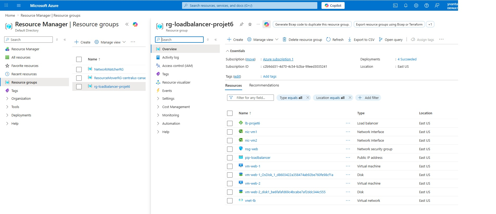
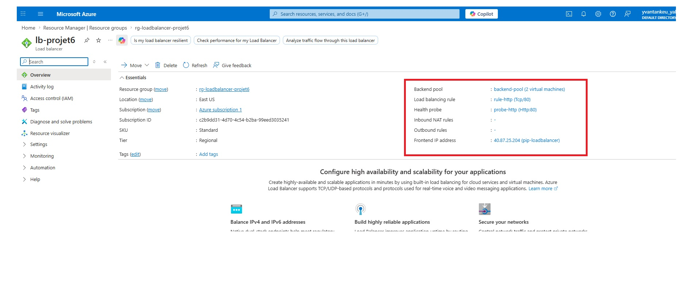
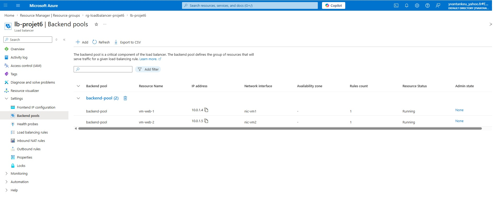
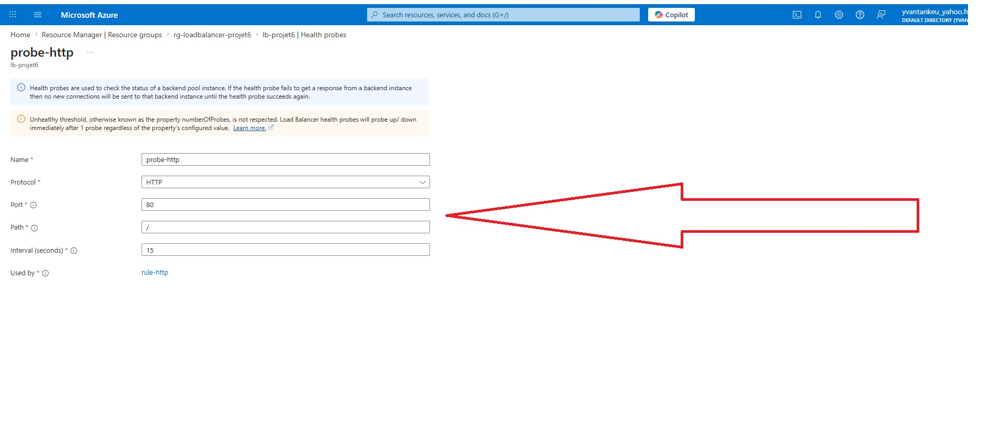
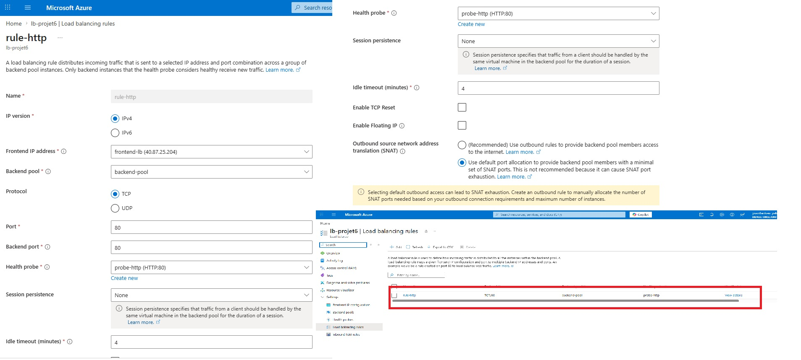
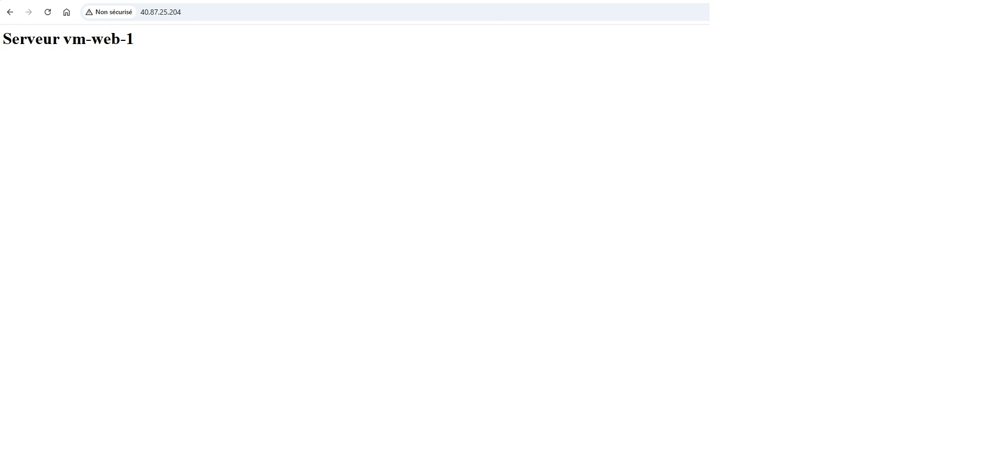

# Projet 6 — Load Balancer Standard avec 2 VMs Apache

## Objectif
Déployer un Load Balancer Standard Azure qui distribue le trafic HTTP entre deux VMs Ubuntu hébergeant Apache, avec health probe automatique pour la haute disponibilité.

## Architecture

```
Internet
    │
    │ Port 80 (HTTP)
    ▼
[IP Publique : 40.87.25.204]
    │
    ▼
[Load Balancer Standard — lb-projet6]
    ├── Frontend : frontend-lb
    ├── Règle : rule-http (TCP 80 → 80)
    └── Health Probe : probe-http (HTTP /  toutes les 5s)
    │
    ▼
[Backend Pool — backend-pool]
    ├── nic-vm1 → vm-web-1 (Ubuntu 22.04 + Apache)
    └── nic-vm2 → vm-web-2 (Ubuntu 22.04 + Apache)
         │
         └── dans [Subnet subnet-web — 10.0.1.0/24]
                 └── dans [VNet vnet-lb — 10.0.0.0/16]
                         └── dans [Resource Group rg-loadbalancer-projet6]
                                         └── Region : eastus
```

## Ressources créées

| Ressource | Nom | Détails |
|-----------|-----|---------|
| Resource Group | rg-loadbalancer-projet6 | eastus |
| IP Publique | pip-loadbalancer | 40.87.25.204 (Static, SKU Standard) |
| Load Balancer | lb-projet6 | SKU Standard |
| Frontend IP | frontend-lb | Lié à pip-loadbalancer |
| Backend Pool | backend-pool | nic-vm1 + nic-vm2 |
| Health Probe | probe-http | HTTP port 80, chemin / |
| Règle LB | rule-http | TCP 80 → 80 |
| Virtual Network | vnet-lb | 10.0.0.0/16 |
| Subnet | subnet-web | 10.0.1.0/24 |
| NSG | nsg-web | Ports 22 (SSH), 80 (HTTP) |
| NIC | nic-vm1 | Attachée à vm-web-1 + backend-pool |
| NIC | nic-vm2 | Attachée à vm-web-2 + backend-pool |
| VM | vm-web-1 | Ubuntu 22.04, Apache |
| VM | vm-web-2 | Ubuntu 22.04, Apache |

## Preuves visuelles

### 1. Resource Group — toutes les ressources

> Le Resource Group `rg-loadbalancer-projet6` contenant toutes les ressources du projet.

---

### 2. Vue d'ensemble du Load Balancer

> Le Load Balancer Standard `lb-projet6` avec l'IP publique `40.87.25.204`.

---

### 3. Backend Pool — 2 NICs attachées

> Le backend pool contenant `nic-vm1` et `nic-vm2` avec leurs adresses IP privées.

---

### 4. Health Probe

> La health probe `probe-http` configurée sur HTTP port 80.

---

### 5. Règle de load balancing

> La règle `rule-http` distribuant le trafic TCP port 80 vers le backend pool.

---

### 6. Test — Navigateur HTTP

> Réponse du Load Balancer : `http://40.87.25.204` affiche `Serveur vm-web-1`.

---

## Compétences démontrées

- Azure Load Balancer Standard
- Frontend IP + Backend Pool
- Health Probe HTTP
- Règles de load balancing (TCP)
- Virtual Networks & Subnets
- Network Security Groups (NSG)
- Network Interface Cards (NIC)
- IP Publique statique SKU Standard
- VM Linux sur Azure
- Installation Apache via `az vm run-command`
- Azure CLI

## Commandes clés

```bash
# Créer le Resource Group
az group create --name rg-loadbalancer-projet6 --location eastus

# Créer l'IP publique
az network public-ip create \
  --resource-group rg-loadbalancer-projet6 \
  --name pip-loadbalancer \
  --sku Standard \
  --allocation-method Static

# Créer le Load Balancer
az network lb create \
  --resource-group rg-loadbalancer-projet6 \
  --name lb-projet6 \
  --sku Standard \
  --public-ip-address pip-loadbalancer \
  --frontend-ip-name frontend-lb \
  --backend-pool-name backend-pool

# Créer la health probe
az network lb probe create \
  --resource-group rg-loadbalancer-projet6 \
  --lb-name lb-projet6 \
  --name probe-http \
  --protocol Http \
  --port 80 \
  --path /

# Créer la règle de load balancing
az network lb rule create \
  --resource-group rg-loadbalancer-projet6 \
  --lb-name lb-projet6 \
  --name rule-http \
  --protocol Tcp \
  --frontend-port 80 \
  --backend-port 80 \
  --frontend-ip-name frontend-lb \
  --backend-pool-name backend-pool \
  --probe-name probe-http

# Créer le VNet + Subnet
az network vnet create \
  --resource-group rg-loadbalancer-projet6 \
  --name vnet-lb \
  --address-prefix 10.0.0.0/16 \
  --subnet-name subnet-web \
  --subnet-prefix 10.0.1.0/24

# Créer le NSG + règles
az network nsg create --resource-group rg-loadbalancer-projet6 --name nsg-web
az network nsg rule create --resource-group rg-loadbalancer-projet6 --nsg-name nsg-web --name allow-http --protocol Tcp --priority 100 --destination-port-range 80 --access Allow
az network nsg rule create --resource-group rg-loadbalancer-projet6 --nsg-name nsg-web --name allow-ssh --protocol Tcp --priority 110 --destination-port-range 22 --access Allow

# Créer les NICs liées au backend pool
az network nic create --resource-group rg-loadbalancer-projet6 --name nic-vm1 --vnet-name vnet-lb --subnet subnet-web --network-security-group nsg-web --lb-name lb-projet6 --lb-address-pools backend-pool
az network nic create --resource-group rg-loadbalancer-projet6 --name nic-vm2 --vnet-name vnet-lb --subnet subnet-web --network-security-group nsg-web --lb-name lb-projet6 --lb-address-pools backend-pool

# Créer les VMs
az vm create --resource-group rg-loadbalancer-projet6 --name vm-web-1 --nics nic-vm1 --image Ubuntu2204 --admin-username azureuser --admin-password "AzureP@ss2026!" --no-wait
az vm create --resource-group rg-loadbalancer-projet6 --name vm-web-2 --nics nic-vm2 --image Ubuntu2204 --admin-username azureuser --admin-password "AzureP@ss2026!"

# Installer Apache sur les VMs
az vm run-command invoke --resource-group rg-loadbalancer-projet6 --name vm-web-1 --command-id RunShellScript --scripts "sudo apt-get update -y && sudo apt-get install -y apache2 && echo '<h1>Serveur vm-web-1</h1>' | sudo tee /var/www/html/index.html && sudo systemctl enable apache2 && sudo systemctl start apache2"
az vm run-command invoke --resource-group rg-loadbalancer-projet6 --name vm-web-2 --command-id RunShellScript --scripts "sudo apt-get update -y && sudo apt-get install -y apache2 && echo '<h1>Serveur vm-web-2</h1>' | sudo tee /var/www/html/index.html && sudo systemctl enable apache2 && sudo systemctl start apache2"

# Récupérer l'IP publique du Load Balancer
az network public-ip show --resource-group rg-loadbalancer-projet6 --name pip-loadbalancer --query ipAddress --output tsv

# Éteindre les VMs (économiser les coûts)
az vm deallocate --resource-group rg-loadbalancer-projet6 --name vm-web-1
az vm deallocate --resource-group rg-loadbalancer-projet6 --name vm-web-2

# Supprimer toutes les ressources
az group delete --name rg-loadbalancer-projet6 --yes
```

## Description pour CV

> Déployé un Load Balancer Standard Azure distribuant le trafic HTTP entre deux VMs Ubuntu 22.04 hébergeant Apache. Configuration complète via Azure CLI : IP publique statique, frontend IP, backend pool, health probe HTTP et règle de load balancing TCP. Intégration des NICs directement dans le backend pool pour une distribution automatique du trafic. Installation d'Apache via `az vm run-command` sans connexion SSH.

**Compétences :** Azure Load Balancer · Backend Pool · Health Probe · VNet · NSG · NIC · VM Linux · Apache · Azure CLI
