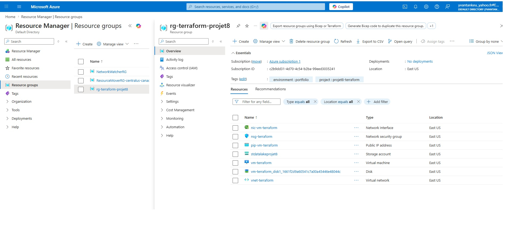
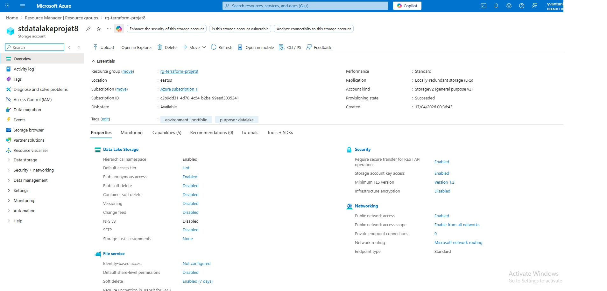
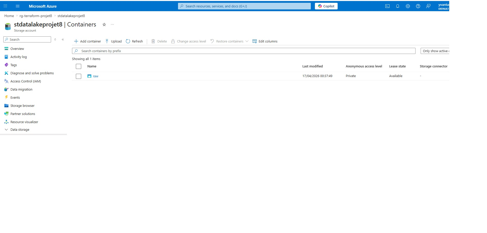
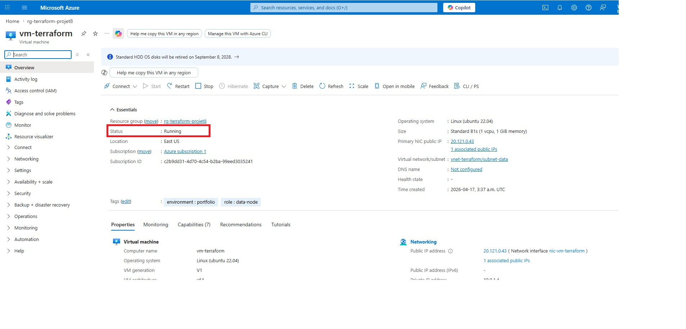
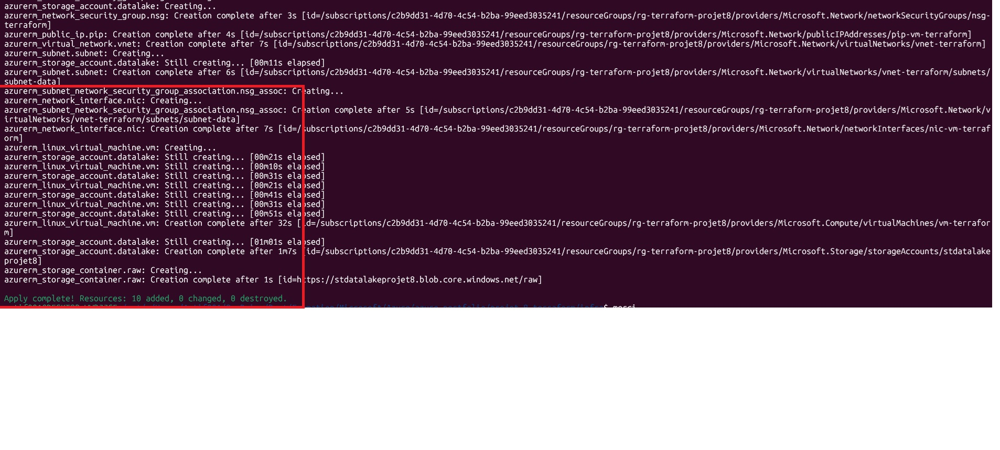

# Projet 8 — Infrastructure as Code avec Terraform

## Objectif
Déployer une infrastructure Azure complète via Terraform (IaC) : réseau, sécurité, Data Lake Gen2 et VM Ubuntu. Démontrer la gestion de l'infrastructure as code avec le provider AzureRM.

## Architecture

```
Terraform (main.tf)
    │
    ▼
[Resource Group — rg-terraform-projet8] (eastus)
    │
    ├── [VNet vnet-terraform — 10.0.0.0/16]
    │       └── [Subnet subnet-data — 10.0.1.0/24]
    │               └── [NSG nsg-terraform — Allow SSH 22]
    │
    ├── [Storage Account stdatalakeprojet8]
    │       └── Data Lake Gen2 (HNS activé)
    │               └── Conteneur : raw (privé)
    │
    └── [VM vm-terraform — Ubuntu 22.04, Standard_B1s]
            └── NIC + IP publique statique
```

## Ressources créées

| Ressource | Nom | Détails |
|-----------|-----|---------|
| Resource Group | rg-terraform-projet8 | eastus, tags environment/project |
| Virtual Network | vnet-terraform | 10.0.0.0/16 |
| Subnet | subnet-data | 10.0.1.0/24 |
| NSG | nsg-terraform | Allow SSH port 22 |
| NSG Association | nsg_assoc | NSG attaché au subnet |
| Storage Account | stdatalakeprojet8 | StorageV2, LRS, HNS=true (Data Lake Gen2) |
| Storage Container | raw | Accès privé |
| IP Publique | pip-vm-terraform | Static, SKU Standard |
| NIC | nic-vm-terraform | IP dynamique privée |
| VM | vm-terraform | Ubuntu 22.04, Standard_B1s |

## Preuves visuelles

### 1. Resource Group — toutes les ressources

> Le Resource Group `rg-terraform-projet8` avec les 10 ressources déployées par Terraform.

---

### 2. Storage Account Data Lake Gen2

> Le Storage Account `stdatalakeprojet8` avec le Hierarchical Namespace (HNS) activé — Data Lake Gen2.

---

### 3. Conteneur raw

> Le conteneur `raw` créé dans le Data Lake pour l'ingestion brute des données.

---

### 4. VM en cours d'exécution

> La VM `vm-terraform` Ubuntu 22.04 déployée et en état Running.

---

### 5. Terraform Apply — 10 ressources créées

> Output du terminal : `Apply complete! Resources: 10 added, 0 changed, 0 destroyed.`

---

## Compétences démontrées

- Terraform (IaC)
- Provider AzureRM
- Infrastructure as Code (IaC)
- Data Lake Gen2 (HNS)
- Azure Storage Account
- Virtual Networks & Subnets
- Network Security Groups
- VM Linux sur Azure
- Tags et gouvernance des ressources
- `terraform init` / `terraform plan` / `terraform apply`

## Commandes clés

```bash
# Initialiser le provider AzureRM
terraform init

# Prévisualiser les ressources à créer
terraform plan

# Déployer l'infrastructure
terraform apply

# Détruire toutes les ressources
terraform destroy
```

## Fichier main.tf

```hcl
terraform {
  required_providers {
    azurerm = {
      source  = "hashicorp/azurerm"
      version = "~> 3.0"
    }
  }
}

provider "azurerm" {
  features {}
}

resource "azurerm_resource_group" "rg" {
  name     = "rg-terraform-projet8"
  location = "eastus"
  tags = {
    environment = "portfolio"
    project     = "projet8-terraform"
  }
}

resource "azurerm_virtual_network" "vnet" {
  name                = "vnet-terraform"
  address_space       = ["10.0.0.0/16"]
  location            = azurerm_resource_group.rg.location
  resource_group_name = azurerm_resource_group.rg.name
}

resource "azurerm_subnet" "subnet" {
  name                 = "subnet-data"
  resource_group_name  = azurerm_resource_group.rg.name
  virtual_network_name = azurerm_virtual_network.vnet.name
  address_prefixes     = ["10.0.1.0/24"]
}

resource "azurerm_network_security_group" "nsg" {
  name                = "nsg-terraform"
  location            = azurerm_resource_group.rg.location
  resource_group_name = azurerm_resource_group.rg.name

  security_rule {
    name                       = "allow-ssh"
    priority                   = 100
    direction                  = "Inbound"
    access                     = "Allow"
    protocol                   = "Tcp"
    source_port_range          = "*"
    destination_port_range     = "22"
    source_address_prefix      = "*"
    destination_address_prefix = "*"
  }
}

resource "azurerm_subnet_network_security_group_association" "nsg_assoc" {
  subnet_id                 = azurerm_subnet.subnet.id
  network_security_group_id = azurerm_network_security_group.nsg.id
}

resource "azurerm_storage_account" "datalake" {
  name                     = "stdatalakeprojet8"
  resource_group_name      = azurerm_resource_group.rg.name
  location                 = azurerm_resource_group.rg.location
  account_tier             = "Standard"
  account_replication_type = "LRS"
  account_kind             = "StorageV2"
  is_hns_enabled           = true
  tags = {
    environment = "portfolio"
    purpose     = "datalake"
  }
}

resource "azurerm_storage_container" "raw" {
  name                  = "raw"
  storage_account_name  = azurerm_storage_account.datalake.name
  container_access_type = "private"
}

resource "azurerm_public_ip" "pip" {
  name                = "pip-vm-terraform"
  location            = azurerm_resource_group.rg.location
  resource_group_name = azurerm_resource_group.rg.name
  allocation_method   = "Static"
  sku                 = "Standard"
}

resource "azurerm_network_interface" "nic" {
  name                = "nic-vm-terraform"
  location            = azurerm_resource_group.rg.location
  resource_group_name = azurerm_resource_group.rg.name

  ip_configuration {
    name                          = "internal"
    subnet_id                     = azurerm_subnet.subnet.id
    private_ip_address_allocation = "Dynamic"
    public_ip_address_id          = azurerm_public_ip.pip.id
  }
}

resource "azurerm_linux_virtual_machine" "vm" {
  name                            = "vm-terraform"
  resource_group_name             = azurerm_resource_group.rg.name
  location                        = azurerm_resource_group.rg.location
  size                            = "Standard_B1s"
  admin_username                  = "azureuser"
  admin_password                  = "AzureP@ss2026!"
  disable_password_authentication = false
  network_interface_ids           = [azurerm_network_interface.nic.id]

  os_disk {
    caching              = "ReadWrite"
    storage_account_type = "Standard_LRS"
  }

  source_image_reference {
    publisher = "Canonical"
    offer     = "0001-com-ubuntu-server-jammy"
    sku       = "22_04-lts"
    version   = "latest"
  }

  tags = {
    environment = "portfolio"
    role        = "data-node"
  }
}
```

## Description pour CV

> Déployé une infrastructure Azure complète via Terraform (IaC) : Resource Group, VNet, Subnet, NSG, Data Lake Gen2 (Storage Account avec HNS activé), conteneur d'ingestion `raw` et VM Ubuntu 22.04. Utilisation du provider AzureRM v3, `terraform init / plan / apply` pour un déploiement reproductible et versionné. Tags de gouvernance appliqués sur toutes les ressources.

**Compétences :** Terraform · IaC · AzureRM Provider · Data Lake Gen2 · VNet · NSG · VM Linux · Azure CLI
