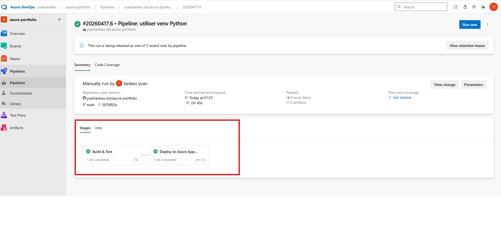
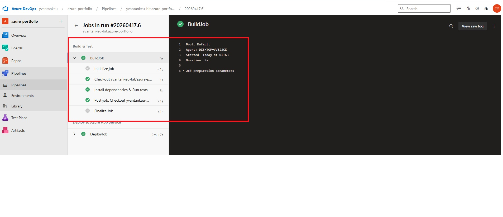
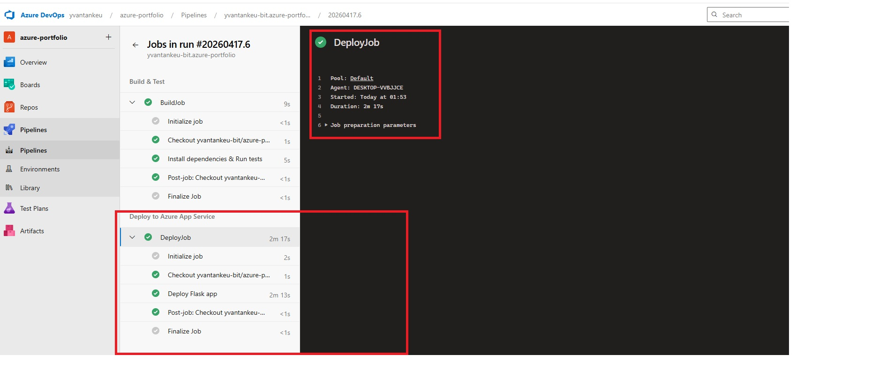
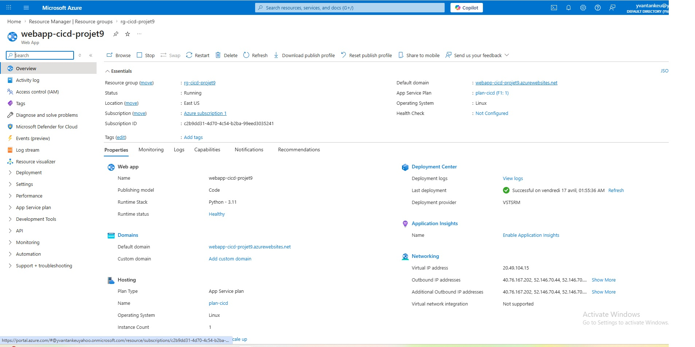

# Projet 9 — CI/CD avec Azure DevOps

## Objectif
Mettre en place un pipeline CI/CD complet avec Azure DevOps : déclenchement automatique au push GitHub, exécution des tests unitaires, et déploiement continu d'une API Flask sur Azure App Service.

## Architecture

```
GitHub (azure-portfolio)
    │
    │ git push → branche main
    ▼
Azure DevOps Pipeline (azure-pipelines.yml)
    │
    ├── Stage 1 : Build & Test
    │     └── python3 -m venv
    │     └── pip install requirements.txt
    │     └── pytest tests/ -v (2 tests)
    │
    └── Stage 2 : Deploy
          └── AzureWebApp@1
                └── Azure App Service Linux (Python 3.11)
                      └── webapp-cicd-projet9.azurewebsites.net
```

## Ressources créées

| Ressource | Nom | Détails |
|-----------|-----|---------|
| Resource Group | rg-cicd-projet9 | eastus |
| App Service Plan | plan-cicd | FREE, Linux |
| App Service | webapp-cicd-projet9 | Python 3.11, Linux |
| Azure DevOps Org | yvantankeu | dev.azure.com/yvantankeu |
| Azure DevOps Project | azure-portfolio | Private |
| Pipeline | azure-pipelines.yml | Déclenché sur push main |
| Agent | DESKTOP-VVBJJCE | Self-hosted, pool Default |

## App Flask déployée

```
projet-9-cicd-devops/app/
  app.py              ← API Flask
  requirements.txt    ← flask, gunicorn, pytest
  tests/
    test_app.py       ← 2 tests pytest
```

**Endpoints :**
- `GET /health` → `{"status": "ok", "service": "data-platform-api"}`
- `GET /info` → `{"project": "Projet 9 - CI/CD Azure DevOps", ...}`

## Preuves visuelles

### 1. Pipeline Azure DevOps — 2 stages au vert

> Les stages Build & Test et Deploy to Azure App Service complétés avec succès.

---

### 2. Stage Build — Tests pytest passés

> Installation des dépendances et exécution des tests unitaires pytest.

---

### 3. Stage Deploy — Déploiement réussi

> Déploiement automatique sur Azure App Service via la tâche AzureWebApp@1.

---

### 4. App Service dans le portail Azure

> Le Web App `webapp-cicd-projet9` en état Running sur Azure.

---

### 5. API déployée — Réponse en production

> Réponse de l'endpoint `/health` : `{"service":"data-platform-api","status":"ok"}`

---

## Compétences démontrées

- Azure DevOps (Pipelines, Service Connections)
- CI/CD (Intégration Continue / Déploiement Continu)
- Pipeline YAML multi-stages (Build + Deploy)
- Tests unitaires automatisés (pytest)
- Azure App Service (Linux, Python)
- Agent auto-hébergé (self-hosted)
- GitHub → Azure DevOps integration
- Python Flask API

## Fichier azure-pipelines.yml

```yaml
trigger:
  branches:
    include:
      - main

pool:
  name: Default

stages:
  - stage: Build
    displayName: Build & Test
    jobs:
      - job: BuildJob
        steps:
          - checkout: self
          - script: |
              python3 -m venv venv
              source venv/bin/activate
              pip install -r projet-9-cicd-devops/app/requirements.txt
              pytest projet-9-cicd-devops/app/tests/ -v
            displayName: 'Install dependencies & Run tests'

  - stage: Deploy
    displayName: Deploy to Azure App Service
    dependsOn: Build
    jobs:
      - job: DeployJob
        steps:
          - task: AzureWebApp@1
            displayName: 'Deploy Flask app'
            inputs:
              azureSubscription: 'azure-service-connection'
              appType: 'webAppLinux'
              appName: 'webapp-cicd-projet9'
              package: '$(System.DefaultWorkingDirectory)/projet-9-cicd-devops/app'
              runtimeStack: 'PYTHON|3.11'
              startUpCommand: 'gunicorn --bind=0.0.0.0 app:app'
```

## Commandes clés

```bash
# Créer l'infrastructure
az group create --name rg-cicd-projet9 --location eastus
az appservice plan create --name plan-cicd --resource-group rg-cicd-projet9 --sku FREE --is-linux
az webapp create --name webapp-cicd-projet9 --resource-group rg-cicd-projet9 --plan plan-cicd --runtime "PYTHON:3.11"

# Tester l'API déployée
curl https://webapp-cicd-projet9.azurewebsites.net/health

# Supprimer les ressources
az group delete --name rg-cicd-projet9 --yes
```

## Description pour CV

> Mis en place un pipeline CI/CD complet avec Azure DevOps : déclenchement automatique au push GitHub sur la branche main, exécution des tests unitaires pytest en stage Build, et déploiement continu d'une API Flask Python sur Azure App Service Linux. Configuration d'un agent auto-hébergé, Service Connections GitHub et Azure Resource Manager, pipeline YAML multi-stages.

**Compétences :** Azure DevOps · CI/CD · Pipeline YAML · pytest · Flask · App Service · GitHub Integration · Self-hosted Agent
